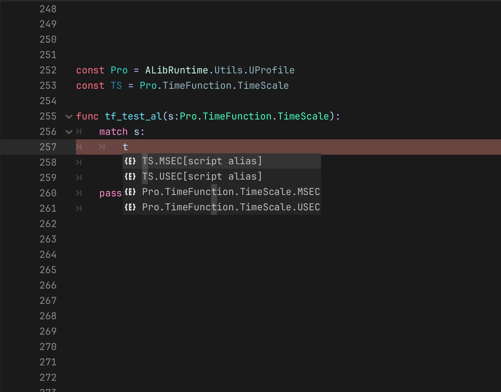
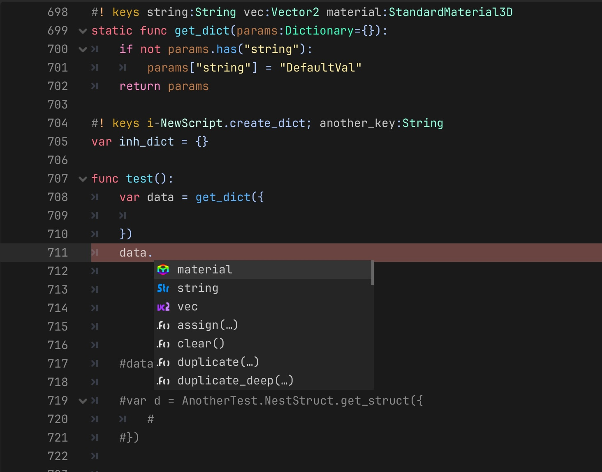
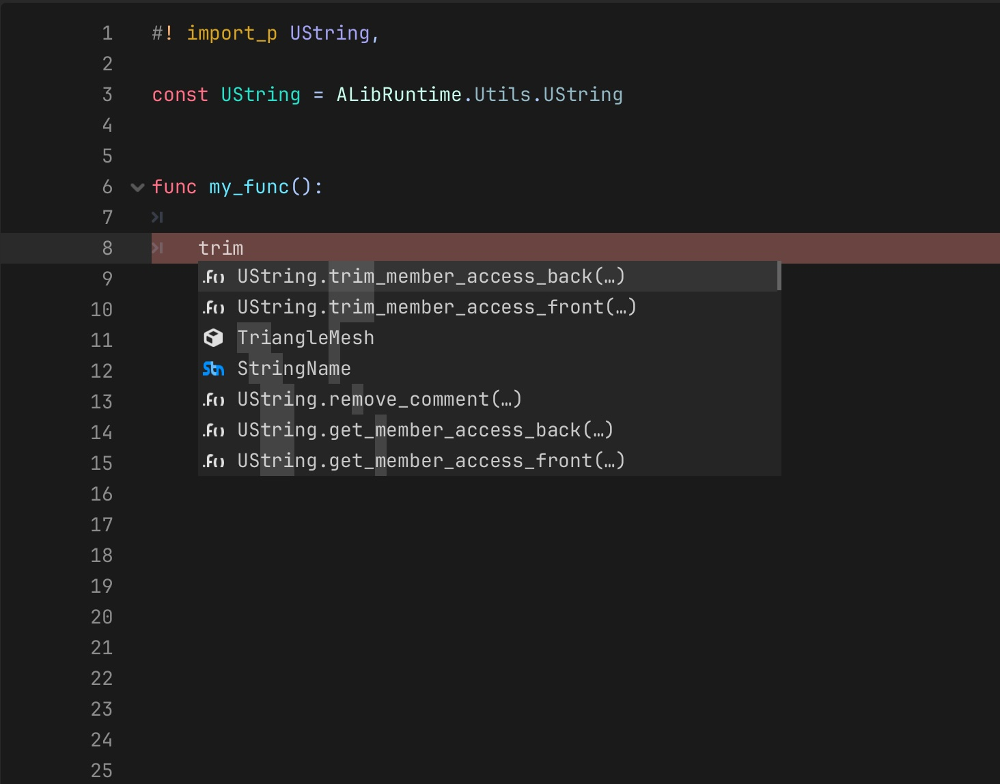

# Godot Code Completions

This plugin provides a class with hooks to trigger a code completion request in the Godot script editor. You can create your own or there are some built ins you can use.

### Install
Download the package in releases, and unzip into addons/.

Optional dependency: [Tree-sitter](https://github.com/brohd11/Godot-TreeSitter-Wrapper) used by the underlying parser. Increases performance, but not necessary to function.

Alternatively, you can use: [gdaddon - Addon Manager](https://github.com/brohd11/gdaddon) to install and manage plugins and their dependencies.

### Setup
After install, some of the features are off by default. the settings can be found in EditorSettings -> plugin/code_completion/.

Ensure the EditorSettings advanced settings toggle is on if you can’t see them.

## Built-In Completions
All of these completions are toggleable.

 - hide private - when accessing a member, hide names with leading underscore
 - new - classes have “Class.new()” as a suggestion
 - enum - if a member, or argument is typed as an enum, finds the enum and lists the members
 - extended type hints - the editor doesn’t handle preloaded types in every situation, attempts to extend to all valid places
 - const key - when defining a const string, suggests strings based on const name, and location in script
 - member string - completes method and property names written as string arguments: `call("…")`, `set_deferred("…")`, `has_method("…")`, `rpc("…")`, `Callable(obj, "…")`. Resolves the receiver through variables and user scripts, and reads it from argument 0 where that's the object. `set_indexed`/`get_indexed`/`tween_property` also complete property paths past the colon (`"modulate:a"`)

### Tag based
 - dict key - define keys for dictionaries, they will be suggested in a variety of scenarios
 - arg location - define a location to list constants as arguments
 - import (WIP) - tag preloads and global classes to have static functions and constants listed. The insert is “Class.my_static_member"
 - tag parser - completes registered tags, such as for dict key, tags can be registered by plugins

## Custom Completions
It is easy to add your own by creating a class that extends `EditorCodeCompletion`, then instancing it in your plugin.
### More details on usage [here.](export_ignore/doc/editor_code_completion.md)

## Example Images

### Enum

### Dict Key

### Import
